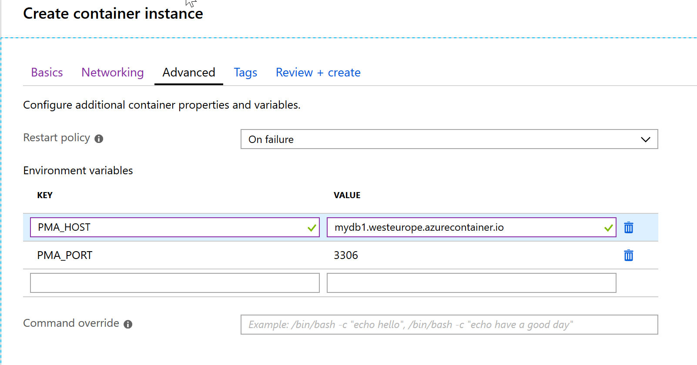

---

---

[TOC]

# Quickstart container in the Azure cloud

To be able to run this quickstart, you need to have the following components:

* On your laptop: 
  * Docker (for Windows or Mac) <https://www.docker.com/products/docker-desktop>
  * Docker running on Linux VM, such as we already used before: VirtualBox with Ubuntu VM
    and Docker Engine
  * Azure CLI <https://docs.microsoft.com/en-us/cli/azure/install-azure-cli?view=azure-cli-latest>
* In the cloud: access to an Azure cloud subscription. You can create a free account at [https://azure.microsoft.com/en-us/free](https://azure.microsoft.com/en-us/free/)[/](https://azure.microsoft.com/en-us/free/) 


## Using public Docker images

We start with using public available images on Docker Hub and see the difference between running it locally and the same in the cloud.

We will use 2 images: MySQL and PHPMyAdmin. The latter image is a web application which is an administration tool for MySQL (or MariaDB) which is used by many web hosting providers.


If you want you can run the Docker images also locally, otherwise skip to the Azure cloud paragraph.


### Local

Open a command prompt / terminal window and type:

`docker run -d --name db1 -p 3306:3306 -e MYSQL_ROOT_PASSWORD=r00tr00t -e MYSQL_DATABASE=db -e MYSQL_USER=db_user -e MYSQL_PASSWORD=dbpwd123 mysql`

This will pull the MySQL (latest) image from Docker Hub and create a MySQL Docker container with a database called `db1` and set a root password and create an additional user `db_user`.

Next create the container with the administration tool by typing:

`docker run -d --name mydbadmin --link db1:db -p 8080:80 phpmyadmin/phpmyadmin`

The `--link` command will give the container access to the other container. 

For more information about both Docker images, see their Docker Hub pages:

* <https://hub.docker.com/_/mysql>
* <https://hub.docker.com/r/phpmyadmin/phpmyadmin>


Check if both containers are running: `docker ps`


Now open a web browser and go to http://localhost:8080


Try to login as db_user.

You probably get some errors about the authentication method used. This has to do with a change in MySQL v8 which we are using. We can solve this by updating the password in the MySQL database.

On the command prompt, type:

`docker exec -it db1 bash`

Now you are logged in the MySQL container.

Type: `mysql -u root -pr00tr00t` (use the same password for root as used when you created the container).

 Now update the password for the `db_user` user:

`alter user db_user identified with mysql_native_password by 'secretuserpassword';`

Type: `exit` and `exit` again to return to your local command prompt.

Now try again to login.


If you go to the Databases tab you will see the `db` database without any tables.

Ok. That is working.

Now we try the same in the Azure cloud.


### Azure cloud

There are multiple ways to create containers in Azure. We will start with using the Azure Portal.

#### Azure Portal

In your browser go to https://portal.azure.com and login into your Azure subscription.

First we will create a new resource group in which we will add our container. Creating a resource group makes it easier to find your components but also to clean it up.

Press the `Create a resource` link in the left sidebar.

Search for `Resource Group` .


Press the `Create` button.

Select a subscription and enter a name for the new resource group, e.g. `containertest`

Select a region, e.g.: `West Europe`.

Press `Review + Create` and then `Create`.

Resource groups are just a grouping of Azure components, there are no costs involved, so you can create as many resource groups as you like (if you are allowed to do so).

Now we will add the MySQL container.

In Azure single Docker containers are created in a component called Azure Container Instance (which is a wrapper for one or more containers). For more information, see the [Azure documentation](https://docs.microsoft.com/en-us/azure/container-instances/). 


Lets create the container.

Press the `Create a resource` link again and search for `container instance` or let's do it another way. Because you can navigate to the home tab of all your container instances by pressing the `All Services` link in the side bar and search for `container instances`.  If you click on the star next to the Container instances services, the link to the home tab will be added to the side bar.

 

Now press the `Container instance` link and the home tab for all container instances will be shown.

Now press the `Add` button.

On the first page, select the previous created resource group. And enter a name for the container.

Select the region (which is probably already set correctly). 

We will use a public image, so the Image Type is Public.

Enter the image name: `mysql`.

Set OS Type to Linux.

And leave the size to 1 cpu and 1.5 GB.


Press Next.

Set Include public IP adress to Yes.

Change the default port 80 to 3306.

Set the DNS name label to something (global) unique: 

Press Next.

On the next page enter the same environment variables you used when creating the container locally.

 

Press Review+Create.

Press Create.

The container will now be created.


When ready click on `Go to resource`.

Make a note of the FQDN (the DNS name the container can be accessed on). We need that for our second container.

Now add another container for PHPMyAdmin.


On the networking tab leave the port tot 80 (currently it is not possible to map a container port to another port as we do locally).

Set a DNS name label.

Press Next.

On the advanced tab, add two environment settings:

PMA_HOST = <dns name of the mysql container>

PMA_PORT = 3306



And create the container.

Also here we will have the same issue with authentication.

Go to the db1 container and open the `Container` subpage and then the `Connect` tab.


Select /bin/bash and press Connect.

And perform the same steps as you have locally to update the `db_user` password: 

`alter user db_user identified with mysql_native_password by 'secretuserpassword';`

And log into PHPMyAdmin. You can find the url on the overview page of the dbadmin container.

And check if you can log in.


Now if you really want to use the database, you will need some persistent storage. Otherwise any change you make to the current running container instance will be lost at restart time of the container. Note that this is different from running it locally. On your local machine the data will remain as long as the container has not been deleted. 

Unfortunately you can not add volumes in the Azure portal like you do locally. But it can be done using the Azure CLI. 

If not done already install Azure CLI on your machine (see the prerequisites).


#### Azure CLI

Azure CLI is a set of commands you can use on the command prompt / terminal. On Windows you can use either command prompt, powershell or WSL (Windows Subsystem for Linux) for this.

The first step is to connect your machine to your Azure account.

Open the command prompt / terminal and type:

`az login`

A browser window will appear and you will need to log into your Azure account. If you have done this, you are ready to go.

We already created the resource group via the portal, but if you wish to create a resource group via Azure CLI, use the following command:

`az group create --name containertest --location westeurope`

Next we create a storage account to store our files for the mysql container:

`az storage account create --name sadb001files --resource-group containertest --sku Standard_LRS` (use any name you like, but only lowercase alphanumeric characters are allowed).

Next create a file share on this account which we will use a a volume mount for the container. You need the connection string to the created storage account for this. You can either find it in the azure portal or use the following azure cli command: `az storage account show-connection-string --name sadb001files --resource-group containertest -o tsv`.

`az storage share create --name dbfileshare --connection-string "..."` (note that the connection string must be enclosed by quotes).

For the volume mount you need the account key for the storage. Use the following azure cli command to retrieve this: `az storage account keys list --resource-group containertest --account-name sadb001files --query "[0].value" --output tsv`.

Next we will create the MySQL container:

```bash
az container create --resource-group containertest --location westeurope --name db2 --image mysql --ip-address public --port 3306 --cpu 1 --memory 1.5 --dns-name-label mydb2  --environment-variables MYSQL_ROOT_PASSWORD="secret" MYSQL_DATABASE="db" MYSQL_USER="db_user" MYSQL_PASSWORD="dbpwd123" --azure-file-volume-account-name sadb001files  --azure-file-volume-account-key "..." --azure-file-volume-share-name dbfileshare --azure-file-volume-mount-path /var/lib/mysql
```

And create the PHPMyAdmin container:

```bash
az container create --resource-group containertest --location westeurope --name dbadmin2 --image phpmyadmin/phpmyadmin --ip-address public --port 80 --cpu 1 --memory 1.5 --dns-name-label dbadmin2 --environment-variables PMA_HOST=db2.westeurope.azurecontainer.io PMA_PORT=3306
```

Also here: update password for the MySQL user and then try to connect using the new PHPMyAdmin container: `alter user db_user identified with mysql_native_password by 'secretuserpassword';`.

Create a table and add some data.

Now stop and start the mysql container and check if the data is still available.

And do the same with the mysql container you created using the portal.

You should see that the second created container still has its data and the first one does not.

> **There is one major note to mention: the container are now running in the cloud and can be accessed over the internet, so if you want to run these containers for a longer period of time you MUST add security measurements!** 


## Use your own containers

We now have seen that is relative simple to use public available Docker containers. Now we do the same when you have your own build container.

In the repository inside the subfolder `demo-app` there is a NodeJS webapp which connects to a MySQL database to add, update and delete some data. You should download the [code-cafe repo](https://github.com/AMIS-Services/code-cafe-20190520) to your machine to get this to work.


### Running it locally using Docker

To get it to work locally you need the MySQL Docker container from the previous paragraph. 

Open a command prompt or terminal window.

Check if the MySQL container is running: `docker ps`. If it is not yet running open a command prompt / terminal and type: `docker start <name of container>`.

Change the directory to the `demo-app` folder and type: `docker build --rm -f "Dockerfile" -t demo-app:latest .`. This command will create a new Docker image locally, named: `demo-app` with tag: `latest`. You can check this by typing `docker image ls demo-app` after the image is created.

Check if the container works by typing: `docker run --rm --name demoapp -p 8080:8080 --link db1:db1 demo-app:latest`.` *Note: db1 is the name of the docker container running MySQL.*

You should see something like:

```
$ docker run --rm --name demoapp -p 8080:8080 --link db1:db1 demo-app:latest

> demo-app@0.0.0 start /app
> node ./bin/www

Executing (default): CREATE TABLE IF NOT EXISTS `Customers` (`id` INTEGER auto_increment , `name` VARCHAR(255), `email` VARCHAR(255), `date_created` DATETIME
DEFAULT NOW(), `date_updated` DATETIME, PRIMARY KEY (`id`)) ENGINE=InnoDB;
Executing (default): SHOW INDEX FROM `Customers` FROM `db`
```

If you open a web browser and navigate to http://localhost:8080/customers you should see the application.


### Running it in Azure Cloud

Next we get it working in the Azure Cloud.

In the local version the image was created in the local Docker registry. But we can not access that from the Azure Cloud. So we need to put our built image in a Docker registry accessible from Azure. We will use the Azure Container Registry (ACR) for this. ACR is a Docker registry within your Azure subscription.

First we will create (new) one. This can be done using the Azure Portal or by using Azure CLI commands. We will use the latter.

Open a command prompt / terminal window if not yet open and type:

`az acr create --resource-group containertest --name codecaferegistry1 --sku Basic`.

The registry name **must be unique within Azure**, and contain 5-50 alphanumeric characters. So maybe you need to use another name.

When the registry is created, you get some output. Take note of `loginServer` in the output, which is the fully qualified registry name (all lowercase). 

Before pushing and pulling container images, you must log in to the registry. Type: `az acr login --name codecaferegistry1`.

Navigate to the demo-app folder.

#### Building the image

You can either start the Docker build process on Azure using ACR Tasks or build the image first locally and push it to ACR.

##### ACR Task

Let try the ACR Tasks method first.

Type: `az acr build --registry codecaferegistry1 --image demo-app:1.0 .` and the build process will start. The source code will be pushed to Azure for building

After the build is done, type: `az acr repository list --name codecaferegistry1 --output table` to check if the image is available in your ACR.

You can also check it in the Azure portal by navigating to the Container registries service.


##### Build, tag and push

Using ACR Task the source code is pushed to Azure. You can also push only the image. In that case, you first build the image and tag it with the remote docker registry and then push it.

Build and tag the image: `docker build --rm -f "Dockerfile" -t codecaferegistry1.azurecr.io/demo-app:1.0 .`

Push the image: `docker push codecaferegistry1.azurecr.io/demo-app:1.0`

Now let's create a container based on our own image.

Type:

``````bash
az container create --resource-group containertest --location westeurope --name demoapp --image codecaferegistry1.azurecr.io/demo-app:1.0 --ip-address public --port 8080 --cpu 1 --memory 1.5 --dns-name-label demoapp --environment-variables DB_HOST=mydb2.westeurope.azurecontainer.io DB_PORT=3306
``````

Oh oh, that didn't work. We need a username and password.

The easiest (and not the best way) is to enable the admin user on registry.

In the Azure Portal navigate to your container registry. Go to the 'Access keys' tab and enable the Admin user. Now you will get a username and password.

Now try again:

```bash
az container create --resource-group containertest --location westeurope --name demoapp --image codecaferegistry1.azurecr.io/demo-app:1.0 --ip-address public --port 8080 --cpu 1 --memory 1.5 --dns-name-label demoapp --environment-variables DB_HOST=mydb2.westeurope.azurecontainer.io DB_PORT=3306 --registry-login-server codecaferegistry1.azurecr.io --registry-username codecaferegistry1 --registry-password "<admin password>"
```

A better (and more secure) way is to use a service principal. See the [Azure Documentation](https://docs.microsoft.com/en-us/azure/container-registry/container-registry-tutorial-quick-task) for more details how to do this.


### Multi container group deployment

As you may have noticed in the Azure Portal under the Container Instance, you see the tab "Containers" in plural. But until now we have only one container per instance. 

It is possible to deploy multiple containers in a single instance. It is a bit more involved to do so, you need to use a deployment YAML file for this. 

In the repo there is an example: `aci-demo-deploy.yaml`. This deployment YAML file will create a container instance with 2 containers: the MySQL database and the webapp and only the webapp port is exposed to the public. The exact options to use in the YAML file is not really documented, but the JSON template format is. And the YAML file is just the YAML format of the sample template. See the [Azure Template Documentation](https://docs.microsoft.com/en-us/azure/templates/microsoft.containerinstance/2018-10-01/containergroups) for more details.

Open the `aci-demo-deploy.yaml` file and update the elements to match the settings you used in the previous paragraph to create the containers, such as the container registry password and the storage account key for the file share.

If the yaml file is up to date, you can deploy the container group with the following command:

`az container create --resource-group containertest --file aci-demo-deploy.yaml`.

*Note that you need to update the mysql password in the db container to make it work (just like you did earlier) and restart the container instance afterwards: `alter user db_user identified with mysql_native_password by 'secretuserpassword';`*


